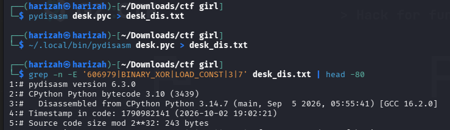
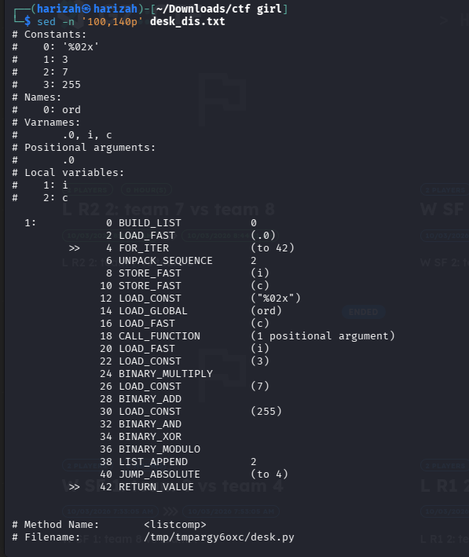
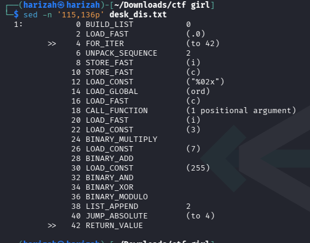
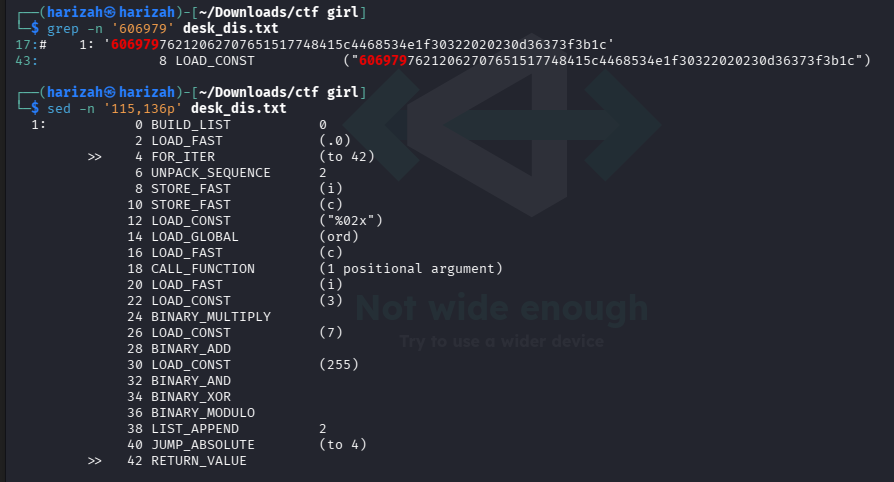
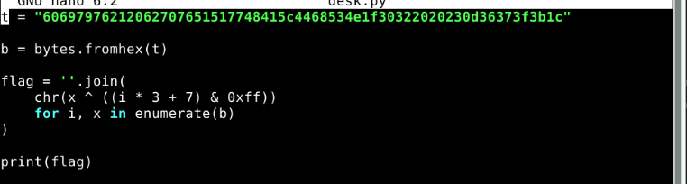
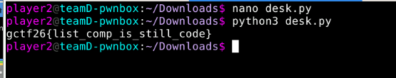

# Comprehend Me

The attachment is compiled Python bytecode (`desk.pyc`). The bytecode is for CPython 3.10, so `xdis`/`pydisasm` is useful when the local interpreter is a different version.

## 1. Disassemble the bytecode

```bash
file desk.pyc
python3 -m pip install --user xdis
~/.local/bin/pydisasm desk.pyc > desk_dis.txt
```



## 2. Recover the transform

```bash
grep -n '606979' desk_dis.txt
sed -n '100,140p' desk_dis.txt
sed -n '115,136p' desk_dis.txt
```







The bytecode loads `ord(c)`, computes `(i * 3 + 7) & 255`, XORs the two values, and formats the result as two hexadecimal digits. In pseudocode:

```python
"%02x" % (ord(c) ^ ((i * 3 + 7) & 0xff))
```

The transformed input is compared with this hardcoded target:

```text
60697976212062707651517748415c4468534e1f30322020230d36373f3b1c
```

Because XOR is self-inverse, the stored hexadecimal bytes can be XORed with the same index-dependent key.

## 3. Invert it

```python
t = "60697976212062707651517748415c4468534e1f30322020230d36373f3b1c"
b = bytes.fromhex(t)

flag = "".join(
    chr(x ^ ((i * 3 + 7) & 0xff))
    for i, x in enumerate(b)
)

print(flag)
```





## Flag

```text
gctf26{list_comp_is_still_code}
```
