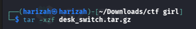
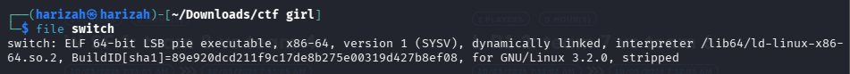
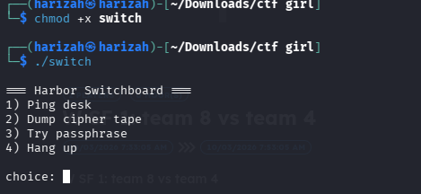
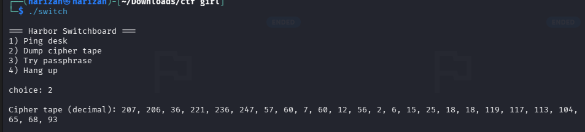
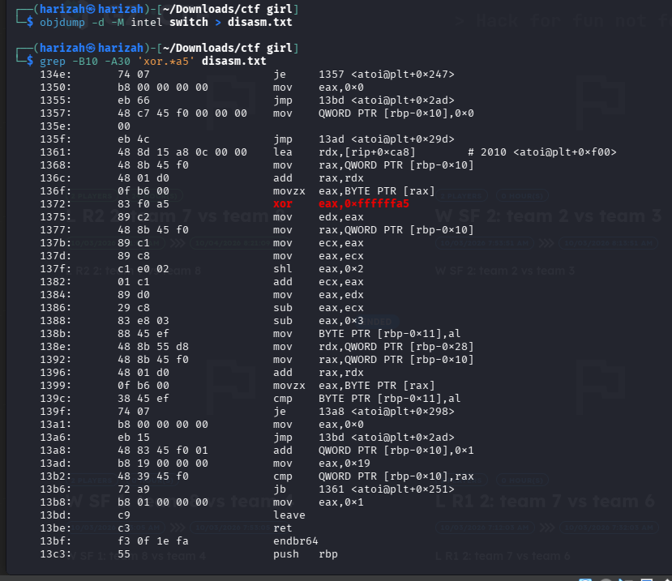
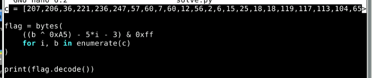
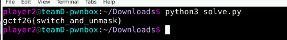

# Desk Switch

`switch` is a stripped 64-bit ELF with a menu-driven flag checker. The menu leaks the encoded byte array, and the disassembly gives the transformation used to validate the passphrase.

## 1. Extract and run

```bash
tar -xzf desk_switch.tar.gz
file switch
chmod +x switch
./switch
```







## 2. Dump the cipher tape

Selecting option `2` reveals 25 encoded bytes.



## 3. Recover the checker formula

```bash
objdump -d -M intel switch > disasm.txt
grep -B10 -A30 'xor.*a5' disasm.txt
```



The relevant loop:

- XORs the stored byte with `0xA5`.
- computes `5*i` using a shift/add sequence.
- subtracts `5*i` and then `3`.
- compares the result with the corresponding input byte.

So the required byte is:

```python
flag[i] = ((cipher[i] ^ 0xA5) - 5*i - 3) & 0xff
```

## 4. Solve

```python
c = [207, 206, 36, 221, 236, 247, 57, 60, 7, 60, 12, 56, 2, 6, 15, 25, 18, 18, 119, 117, 113, 104, 65, 68, 93]

flag = bytes(
    ((b ^ 0xA5) - 5*i - 3) & 0xff
    for i, b in enumerate(c)
)

print(flag.decode())
```





## Flag

```text
gctf26{switch_and_unmask}
```
