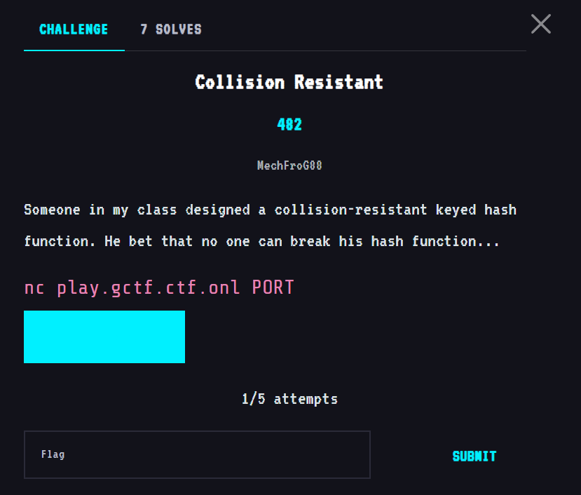
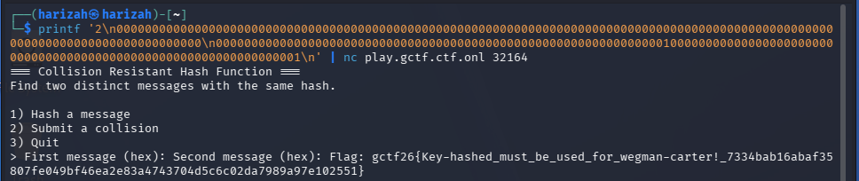

# Collision Resistant

The service asks for two distinct messages with the same keyed-hash output.



The original write-up preserved the successful terminal interaction: two distinct hexadecimal messages were submitted through the collision option, and the service accepted them.



> The original document preserves the successful pair and resulting flag, but it does **not** preserve enough derivation of the keyed-hash construction to reconstruct the mathematical collision method from the write-up alone. I am keeping this section evidence-based rather than filling in missing analysis.

## Flag

```text
gctf26{key-hashed_must_be_used_for_wegman-carter!_7334bab16abaf35807fe049bf46ea2e83a4743704d5c6c02da7989a97e102551}
```
