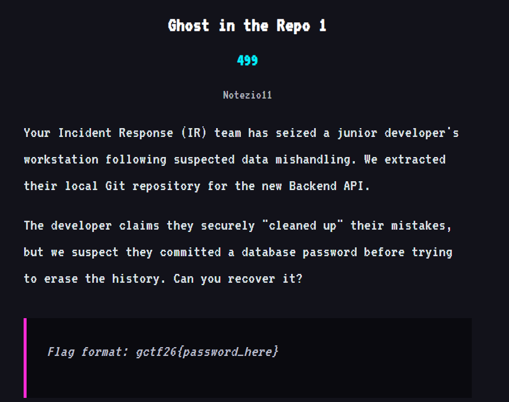
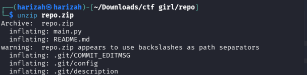
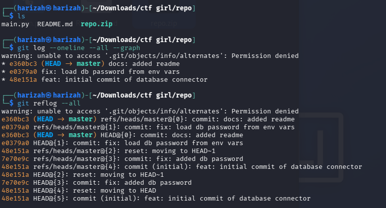
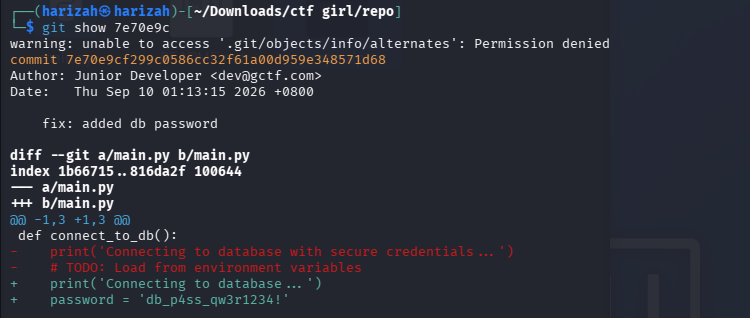

# Ghost in the Repo 1

The challenge asks for a database password that had been committed and later removed from a local Git repository.



## 1. Extract and inspect history

```bash
unzip repo.zip
cd repo
git log --oneline --all --graph
git reflog --all
```





A historical commit named `fix: added db password` was inspected:

```bash
git show 7e70e9c
```

The diff reveals:

```python
password = 'db_p4ss_qw3r1234!'
```



## Flag

```text
gctf26{db_p4ss_qw3r1234!}
```
