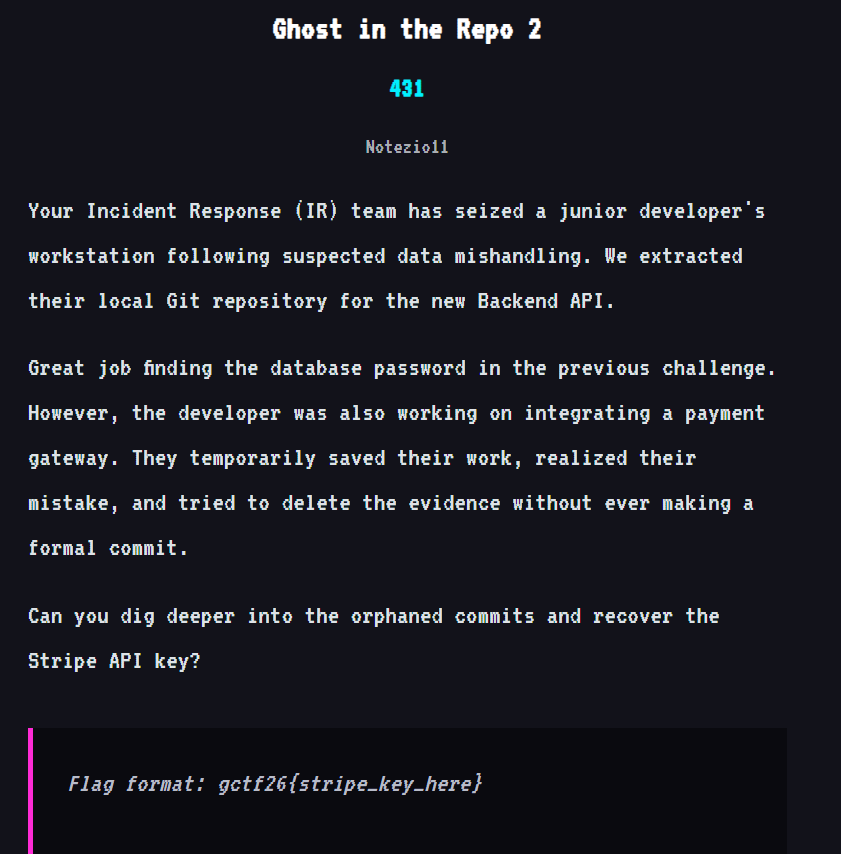
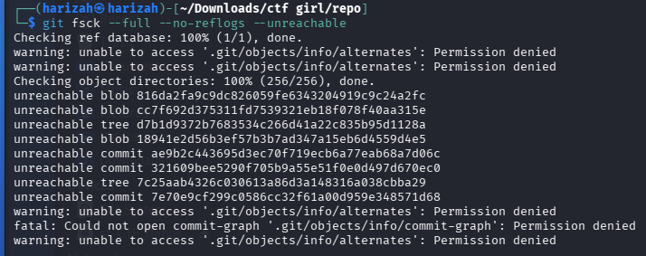
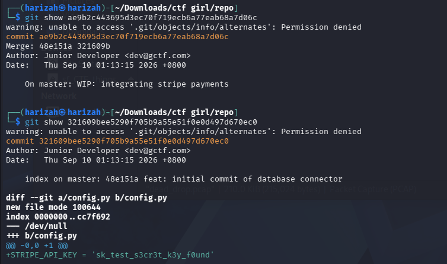

# Ghost in the Repo 2

The second challenge asks for a Stripe API key from work that was deleted without becoming part of the visible branch history.



## 1. Find unreachable objects

```bash
git fsck --full --no-reflogs --unreachable
```



An unreachable commit describing Stripe integration was inspected:

```bash
git show ae9b2c443695d3ec70f719ecb6a77eab68a7d06c
git show 321609bee5290f705b9a55e51f0e0d497d670ec0
```

The recovered file contains:

```python
STRIPE_API_KEY = 'sk_test_s3cr3t_k3y_f0und'
```



## Flag

```text
gctf26{sk_test_s3cr3t_k3y_f0und}
```
