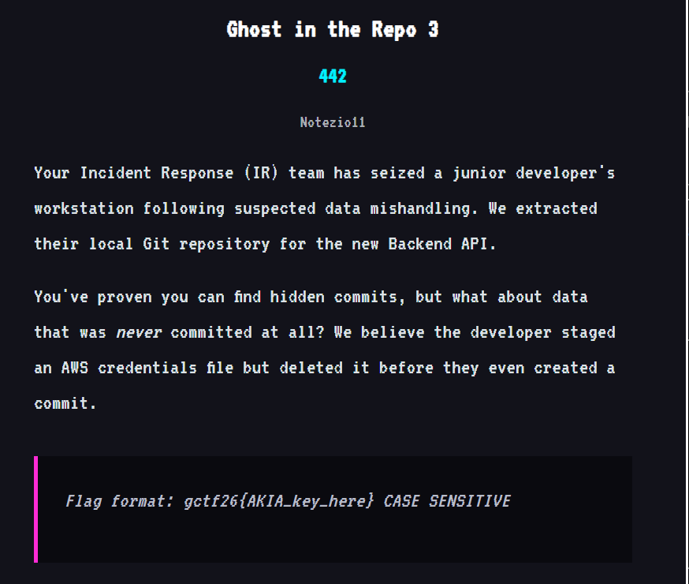
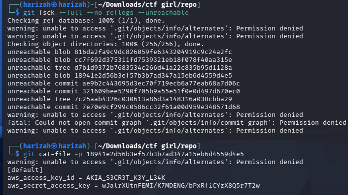

# Ghost in the Repo 3

The third challenge targets data that was staged but never committed: an AWS credentials file.



The preserved workflow uses Git object recovery:

```bash
git fsck --full --no-reflogs --unreachable
git cat-file -p 18941e2d56b3ef57b3b7ad347a15eb6d4559d4e5
```



The object contains:

```text
aws_access_key_id = AKIA_S3CR3T_K3Y_L34K
aws_secret_access_key = ...
```

The challenge flag format specifically requests the `AKIA` key.

## Flag

```text
gctf26{AKIA_S3CR3T_K3Y_L34K}
```
