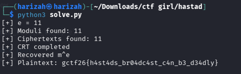

# Håstad la Vista

The challenge broadcasts the same RSA plaintext to 11 recipients using the same small public exponent, `e = 11`.


## Håstad's Broadcast Attack

For each recipient:

```text
c_i = m^11 mod n_i
```

With 11 ciphertext/modulus pairs, the Chinese Remainder Theorem reconstructs `m^11` modulo the product of all moduli. Under the challenge conditions, this is the exact integer value of `m^11`. Taking the exact integer 11th root recovers `m`.

The preserved solver:

1. parses `e`, all `n_i`, and all `c_i`;
2. combines the congruences with CRT;
3. computes an exact integer 11th root;
4. converts the recovered integer back to bytes.

```bash
python3 solve.py
```



## Flag

```text
gctf26{h4st4ds_br04dc4st_c4n_b3_d34dly}
```
