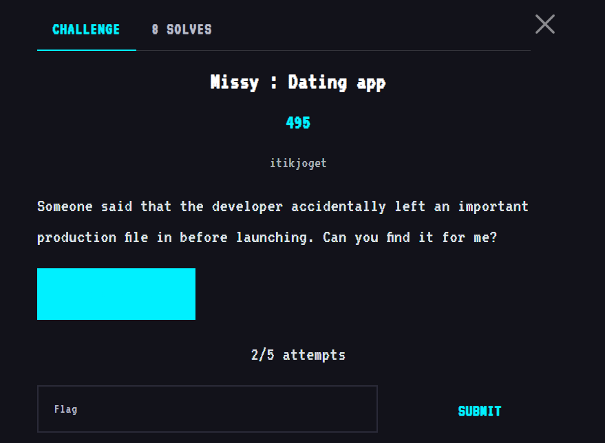
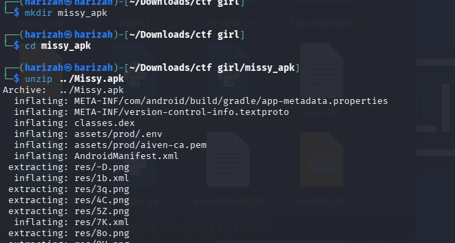
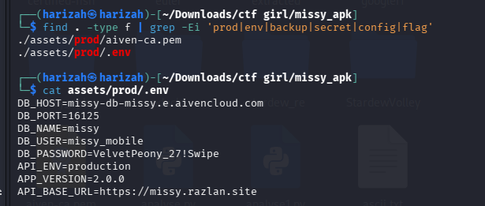
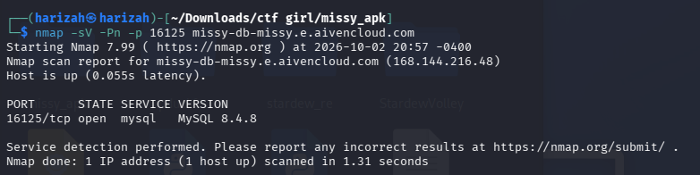
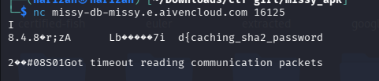
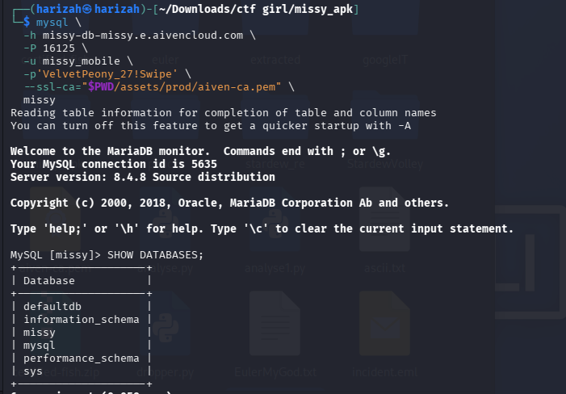
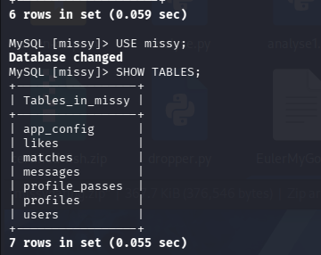
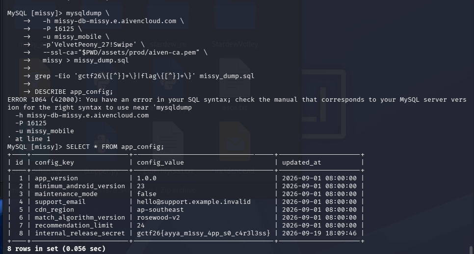
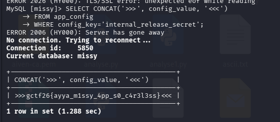

# Missy: Dating App

The APK contained a production environment file with database credentials. The write-up used those credentials to connect to the exposed MariaDB instance and query the application configuration.



## 1. Extract the APK

```bash
mkdir missy_apk
cd missy_apk
unzip ../Missy.apk
```



A search for production/configuration files revealed `assets/prod/.env`:

```bash
find . -type f | grep -Ei 'prod|env|backup|secret|config|flag'
cat assets/prod/.env
```



## 2. Confirm and connect to the database

The preserved notes show an Nmap check, a direct TCP test, and then a MariaDB connection using the recovered credentials.







Inside the `missy` database:

```sql
SHOW TABLES;
SELECT * FROM app_config;
```





Querying the `internal_release_secret` configuration value recovered the flag.



## Flag

```text
gctf26{ayya_m1ssy_4pp_s0_c4r3l3ss}
```
