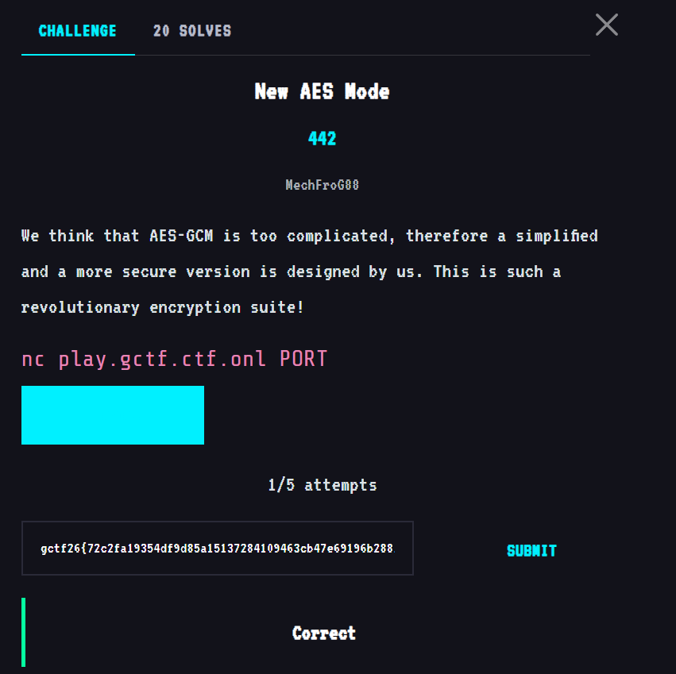
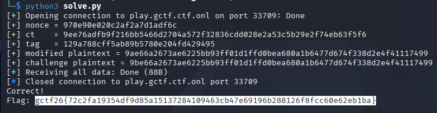

# New AES Mode

The challenge exposes a custom authenticated-encryption design. The preserved exploit derives the nonce-specific authentication mask from the challenge tag, modifies the CTR ciphertext, forges the corresponding tag, and uses the decryption oracle to recover the original plaintext.



## Core observation

The custom tag logic used by the solver is:

```python
digest(ciphertext) = SHA3_256(ciphertext || len(ciphertext))[:16]
mask = tag XOR digest(ciphertext)
```

Because the same nonce-specific mask can be reused for a modified ciphertext:

```python
tag2 = digest(ct2) XOR mask
```

The ciphertext is CTR-like, so flipping one ciphertext bit flips the same plaintext bit. The exploit flips one bit, obtains the modified plaintext from the service, then flips that bit back locally to recover the challenge plaintext.

```bash
python3 solve.py
```



## Flag

```text
gctf26{72c2fa19354df9d85a15137284109463cb47e69196b288126f8fcc60e62eb1ba}
```
