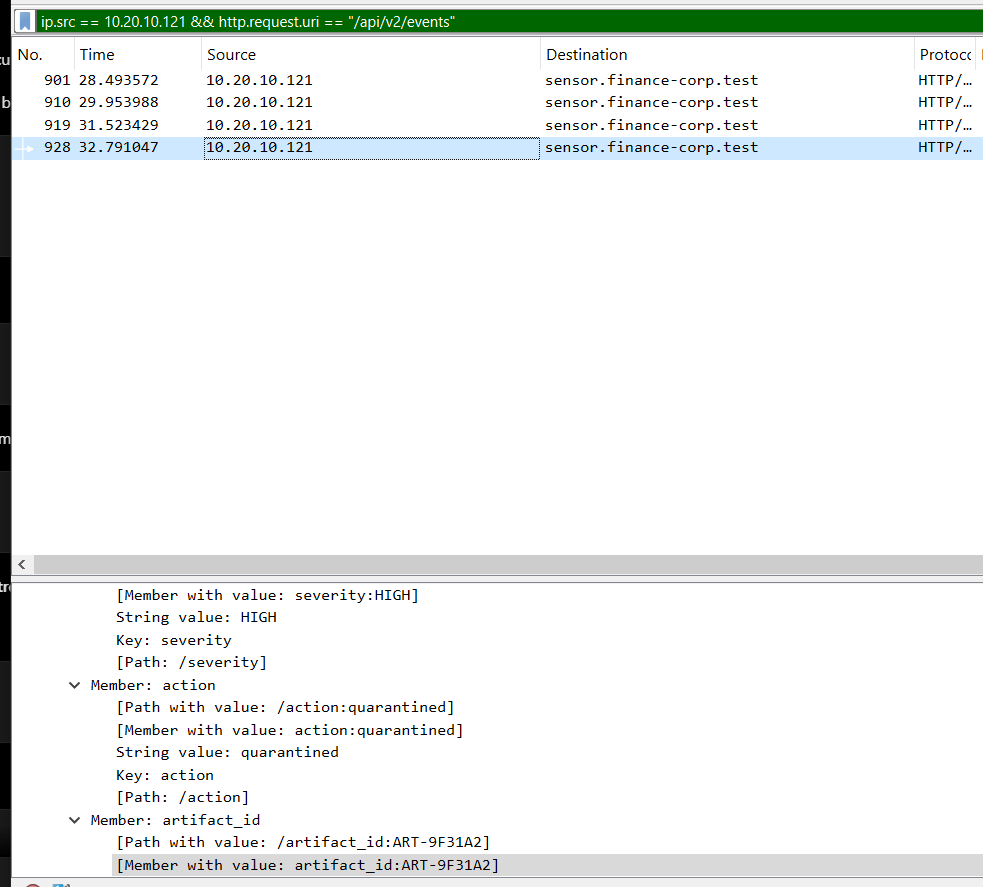
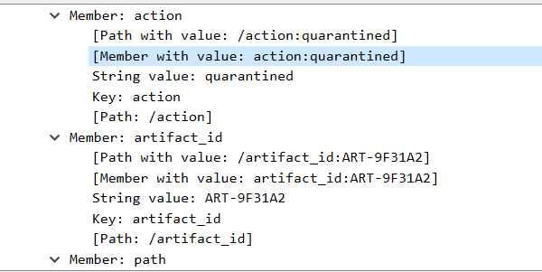
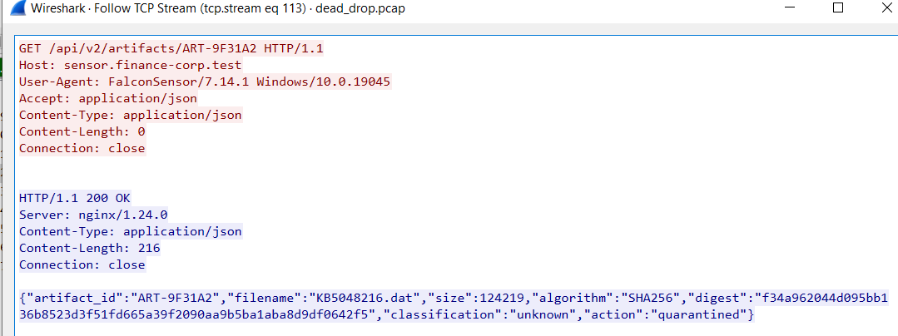
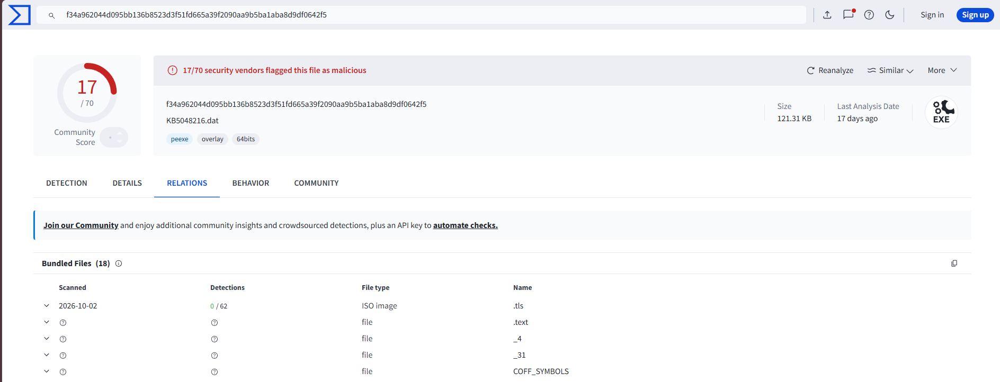
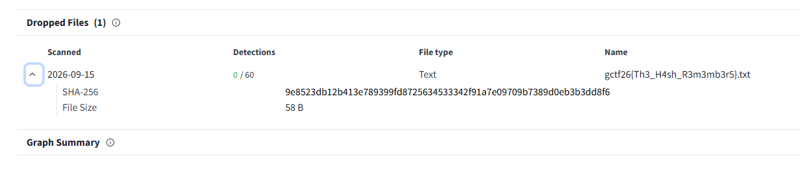
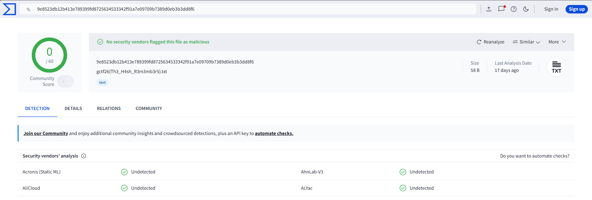

# No Loose Ends

**Status: Solved — PCAP identification + VirusTotal hash pivot**

The challenge states that the suspicious file has already been quarantined and removed, leaving only network traffic behind. The intended pivot is the artifact's digital fingerprint.


## 1. Identify the quarantine event

In Wireshark, filtering the finance workstation traffic reveals a high-severity sensor event. The JSON event shows:

```text
action      = quarantined
artifact_id = ART-9F31A2
```



A closer view confirms the same artifact identifier.



## 2. Query the artifact record

Following the HTTP stream for:

```text
GET /api/v2/artifacts/ART-9F31A2
```

returns an artifact record containing:

```text
artifact_id = ART-9F31A2
filename    = KB5048216.dat
size        = 124219
algorithm   = SHA256
digest      = f34a962044d095bb136b8523d3f51fd665a39f2090aa9b5ba1aba8d9df0642f5
action      = quarantined
```



At this point, the PCAP has established the exact sample fingerprint:

```text
SHA-256: f34a962044d095bb136b8523d3f51fd665a39f2090aa9b5ba1aba8d9df0642f5
```

## 3. Pivot on the SHA-256 in VirusTotal

Searching VirusTotal for the exact SHA-256 returns the same sample, `KB5048216.dat`, confirming that the external record refers to the artifact identified in the PCAP.



Under **Relations → Dropped Files**, VirusTotal records that this sample dropped a text file named:

```text
gctf26{Th3_H4sh_R3m3mb3r5}.txt
```



The dropped text file also has its own VirusTotal entry, providing an additional cross-check of the filename observed in the relation.



## 4. Recover the flag

The challenge format asks for the filename **without the extension**. Removing `.txt` gives:

```text
gctf26{Th3_H4sh_R3m3mb3r5}
```

## Evidence chain

```text
PCAP quarantine event
    ↓
ART-9F31A2
    ↓
KB5048216.dat
    ↓
SHA-256 f34a9620...642f5
    ↓
VirusTotal exact-hash lookup
    ↓
Relations → Dropped Files
    ↓
gctf26{Th3_H4sh_R3m3mb3r5}.txt
    ↓
gctf26{Th3_H4sh_R3m3mb3r5}
```

## Flag

```text
gctf26{Th3_H4sh_R3m3mb3r5}
```
