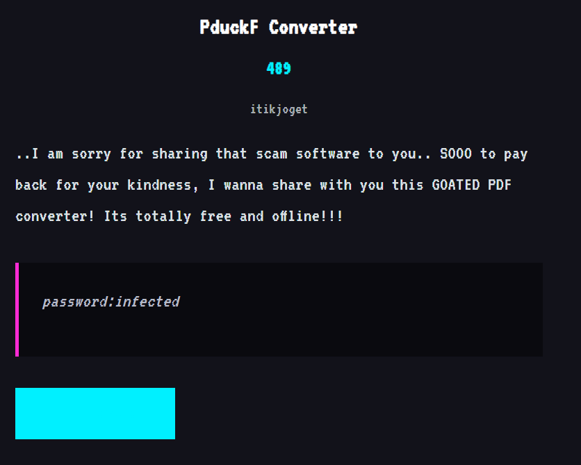
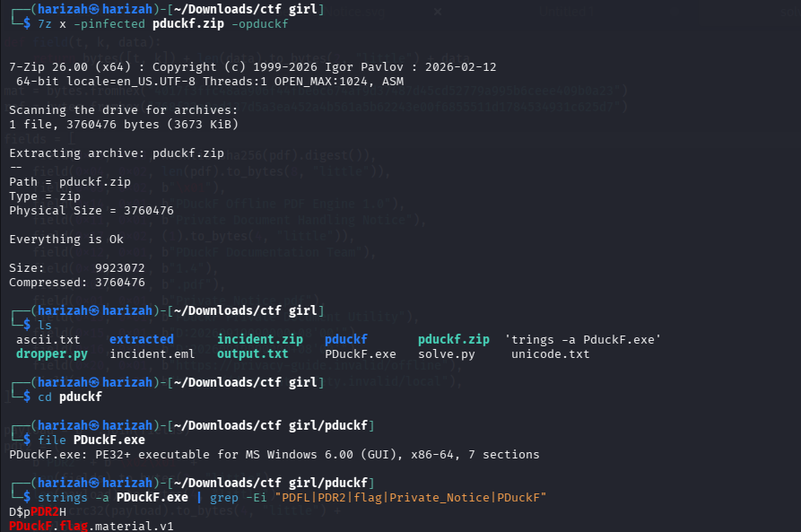
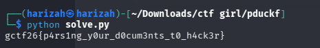

# PDuckF Converter

The supplied archive contains a Windows PE executable. The preserved solve reconstructs a metadata structure from the embedded PDF, derives the AES-GCM key, and decrypts the embedded flag blob.



## 1. Extract and inspect

```bash
7z x -pinfected pduckf.zip -opduckf
cd pduckf
file PDuckF.exe
strings -a PDuckF.exe | grep -Ei 'PDFL|PDR2|flag|Private_Notice|PDuckF'
```



## 2. Reconstruct the key material

The preserved solver:

- locates the `PDFL` encrypted blob;
- extracts the embedded `%PDF-1.4 ... %%EOF` document;
- rebuilds the `PDR2` fields;
- derives `SHA256(b"PDuckF.flag.v1" + mat + SHA256(pdr2))`;
- checks the reference digest;
- decrypts with AES-GCM.

Run:

```bash
python3 solve.py
```



## Flag

```text
gctf26{p4rs1ng_y0ur_d0cum3nts_t0_h4ck3r}
```
