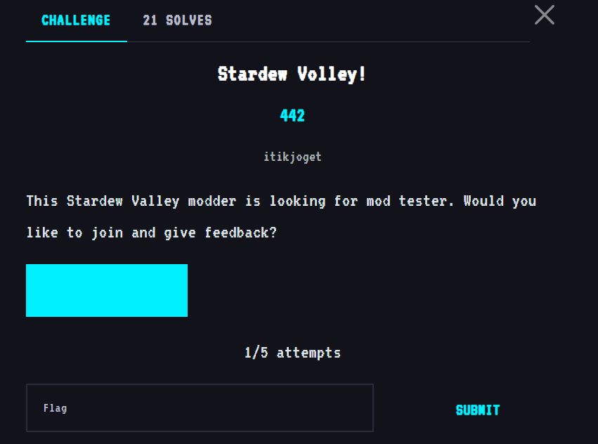
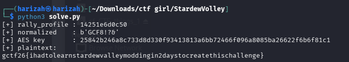

# Stardew Volley!

The original write-up recovers the AES-GCM key material used for `assets/volley.dat` from the mod logic.



## Recovered format and key derivation

The encrypted blob format is:

```text
0x00-0x03  "SVL1"
0x04-0x0f  12-byte nonce
0x10-0x1f  16-byte tag
0x20-end   ciphertext
```

The preserved solver reconstructs:

- `BounceMotion.GetRallyProfile()` from `order` and `mask`;
- `ProtocolRules.Normalize()` from the label `SVP/1.4`;
- the context using `Razlan.StardewVolley\nVolleyball`;
- the SHA-256 AES key.

`SVL1` is used as AES-GCM associated data.

```bash
python3 solve.py
```



## Flag

```text
gctf26{ihadt0learnstardewvalleymoddingin2daystocreatethischallenge}
```
