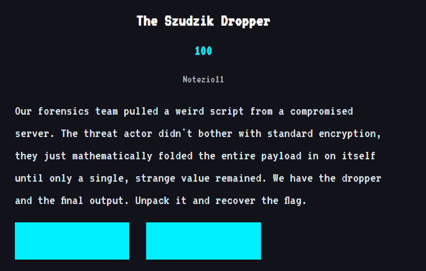
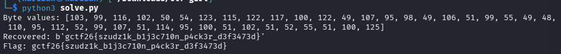

# The Szudzik Dropper

The challenge describes a payload that was repeatedly folded into a single integer using Szudzik pairing. The original write-up reverses that process recursively until every leaf is a byte (`0..255`).



## Solver

The inverse pairing is:

```python
q = isqrt(z)
r = z - q*q

if r < q:
    x, y = r, q
else:
    x, y = q, r - q
```

Because the original payload is byte data, recursion stops once a value is at most `255`.

```bash
python3 solve.py
```



## Flag

```text
gctf26{szudzik_blj3c710n_p4ck3r_d3f3473d}
```
