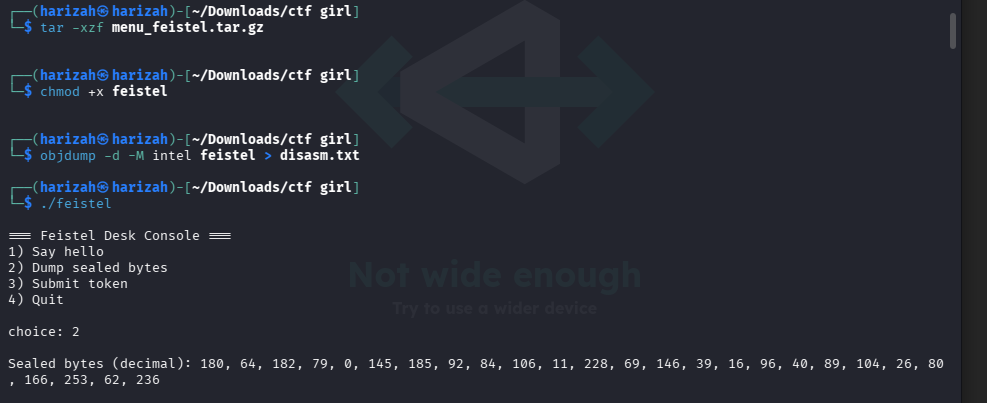
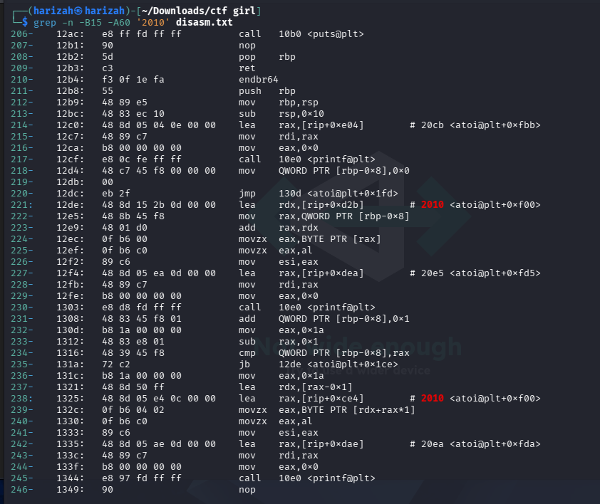
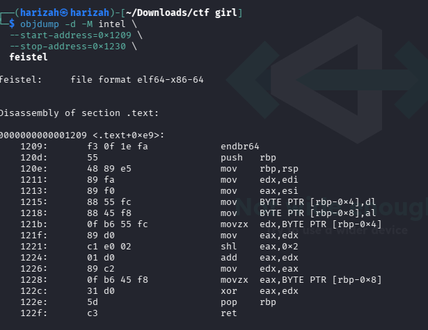
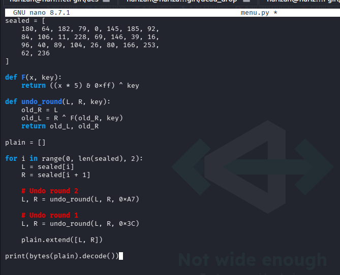
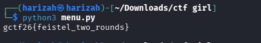

# Menu Feistel

The binary stores an encoded token and validates it using a tiny two-round Feistel construction. The menu exposes the sealed bytes, while the stripped ELF disassembly reveals the round function and keys.

## 1. Extract, run, and dump the sealed bytes

```bash
tar -xzf menu_feistel.tar.gz
chmod +x feistel
./feistel
```

Choose option `2` to dump the sealed bytes.



## 2. Inspect the checker and round function

```bash
objdump -d -M intel feistel > disasm.txt
grep -n -B15 -A60 '2010' disasm.txt
objdump -d -M intel --start-address=0x1209 --stop-address=0x1230 feistel
```





The round function computes:

```text
F(x, k) = ((5 * x) & 0xff) ^ k
```

The checker performs two Feistel rounds using keys `0x3c` and `0xa7`.

For a round

```text
(L, R) -> (R, L XOR F(R, k))
```

the inverse is:

```text
old_R = L
old_L = R XOR F(L, k)
```

Therefore, undo the keys in reverse order: `0xa7` first, then `0x3c`.

## 3. Decrypt each pair

```python
sealed = [
    180, 64, 182, 79, 0, 145, 185, 92,
    84, 106, 11, 228, 69, 146, 39, 16,
    96, 40, 89, 104, 26, 80, 166, 253,
    62, 236
]

def F(x, key):
    return ((x * 5) & 0xff) ^ key

def undo_round(L, R, key):
    old_R = L
    old_L = R ^ F(old_R, key)
    return old_L, old_R

plain = []
for i in range(0, len(sealed), 2):
    L, R = sealed[i], sealed[i + 1]
    L, R = undo_round(L, R, 0xA7)
    L, R = undo_round(L, R, 0x3C)
    plain.extend([L, R])

print(bytes(plain).decode())
```





## Flag

```text
gctf26{feistel_two_rounds}
```
