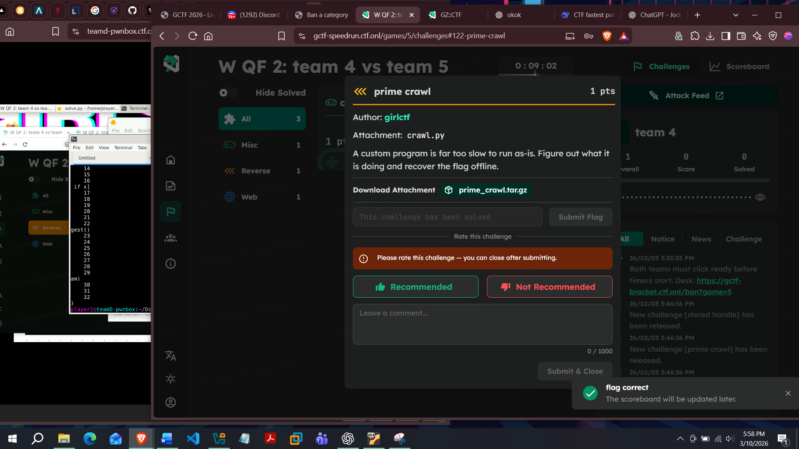
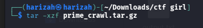
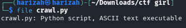
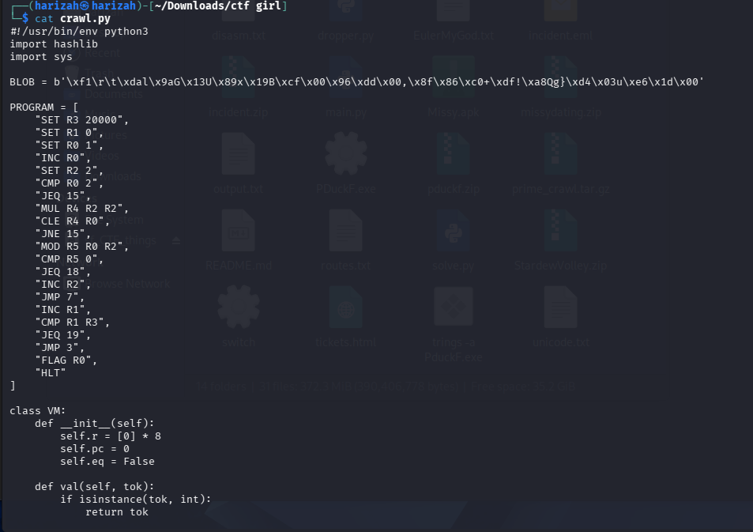
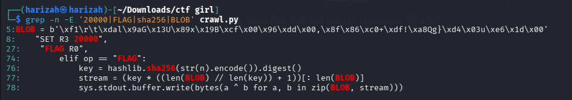
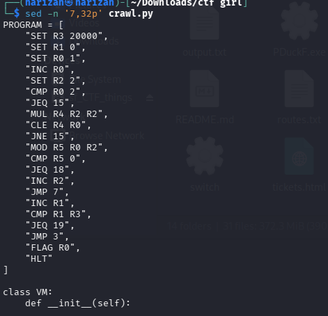
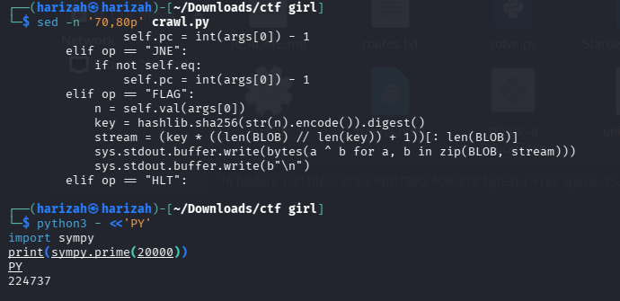
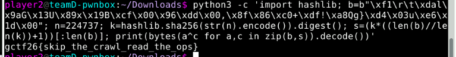

# Prime Crawl

The challenge ships a Python implementation of a deliberately slow custom VM. Rather than running the VM until completion, the useful approach is to understand what the VM is computing and reproduce only the final decryption step.



## 1. Extract and inspect

```bash
tar -xzf prime_crawl.tar.gz
file crawl.py
cat crawl.py
```







## 2. Find the target and flag routine

```bash
grep -n -E '20000|FLAG|sha256|BLOB' crawl.py
sed -n '7,32p' crawl.py
sed -n '70,80p' crawl.py
```

The important observations are:

- `R3` is set to `20000`.
- `R1` is used as the prime counter.
- the VM eventually executes `FLAG R0`.
- `FLAG` hashes the numeric value in `R0` with SHA-256 and XORs the hardcoded `BLOB` with a repeated digest.







The VM performs trial division. Therefore, when the program reaches `FLAG R0`, `R0` is the **20,000th prime**:

```text
224737
```

## 3. Reproduce the decryption

```python
import hashlib

BLOB = b'\xf1\r\t\xdal\x9aG\x13U\x89x\x19B\xcf\x00\x96\xdd\x00,\x8f\x86\xc0+\xdf!\xa8Qg}\xd4\x03u\xe6\x1d\x00'
n = 224737

key = hashlib.sha256(str(n).encode()).digest()
stream = (key * ((len(BLOB) // len(key)) + 1))[:len(BLOB)]
flag = bytes(a ^ b for a, b in zip(BLOB, stream))
print(flag.decode())
```

Run:

```bash
python3 solve.py
```



## Flag

```text
gctf26{skip_the_crawl_read_the_ops}
```
