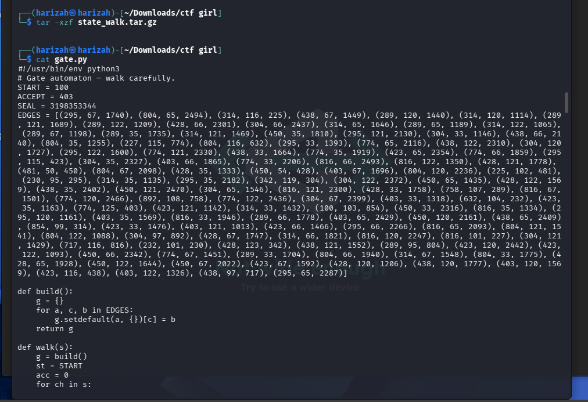
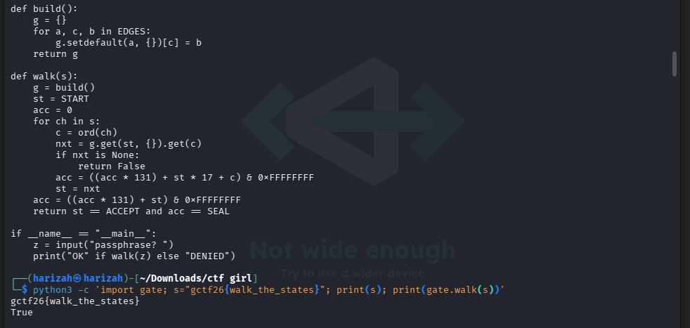

# State Walk

The checker is provided directly in `gate.py`. It treats the passphrase as a walk through a directed state machine. Each character chooses an edge, and a valid input must both finish at `ACCEPT = 403` and satisfy the rolling accumulator `SEAL = 3198353344`.

## 1. Inspect the state machine

```bash
tar -xzf state_walk.tar.gz
cat gate.py
```



## 2. Recover an accepting walk

Following valid transitions from `START = 100` to `ACCEPT = 403` gives:

```text
100 -g-> 854 -c-> 314 -t-> 225 -f-> 481 -2-> 450 -6-> 428 -{-> 342
342 -w-> 304 -a-> 892 -l-> 758 -k-> 289 -_-> 804 -t-> 632 -h-> 232
232 -e-> 230 -_-> 295 -s-> 423 -t-> 438 -a-> 717 -t-> 816 -e-> 227
227 -s-> 774 -}-> 403
```

This spells:

```text
gctf26{walk_the_states}
```

The same sequence also satisfies the accumulator check.

## 3. Verify

```bash
python3 -c "import gate; s='gctf26{walk_the_states}'; print(s); print(gate.walk(s))"
```



## Flag

```text
gctf26{walk_the_states}
```
